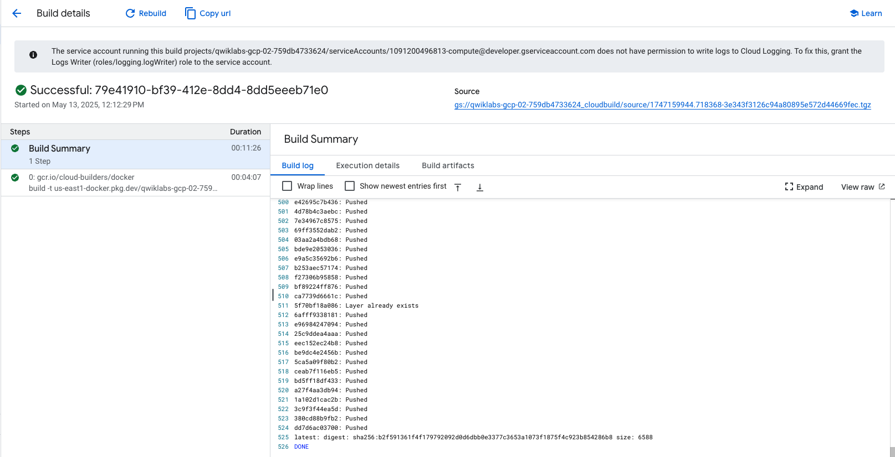
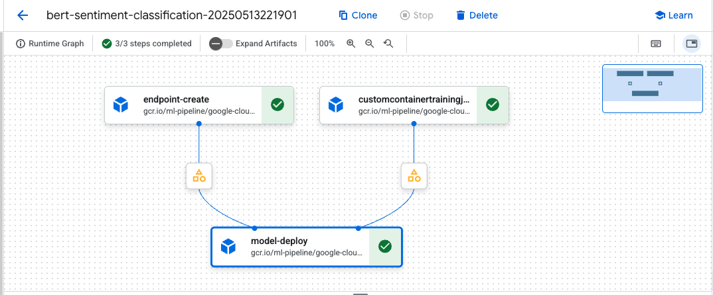

# Tensorflow BERT Sentiment Classifier

Training and deploying a custom TensorFlow BERT sentiment classifier for online predictions on Google Cloud's Vertex AI platform.


## Overview

This project fine-tunes a pre-trained BERT model from TensorFlow Hub to classify movie reviews as positive or negative ([TensorFlow][1]). We develop and experiment locally in a Vertex AI Workbench notebook, package our training code into a Docker container, and push it to Artifact Registry using Cloud Build ([Google Cloud][2], [Google Cloud][3]). A Kubeflow Pipeline on Vertex AI then orchestrates training, model registration, endpoint creation, and deployment for online serving ([Google Cloud][4], [Google Cloud][5]). Finally, we call the deployed endpoint for real-time predictions using the Vertex AI Python SDK ([Google Cloud][6]).

## Concepts Covered

This project repo demonstrates end-to-end development and deployment of a BERT-based sentiment classifier on Google Cloud. Key concepts include:

- **Transfer Learning with BERT**: Fine-tuning a pre-trained BERT model from TensorFlow Hub for binary sentiment classification.
- **TensorFlow & KerasLayer**: Using `hub.KerasLayer` for both text preprocessing and encoding within the `tf.keras` Functional API.
- **Vertex AI Workbench**: Interactive development in a managed JupyterLab environment on GCP.
- **Containerization**: Packaging training code and model artifacts into a Docker image.
- **Artifact Registry & Cloud Build**: Creating a private Docker repo and automating image builds/pushes.
- **Vertex AI Pipelines (Kubeflow Pipelines SDK v2)**: Defining a reusable pipeline that trains, registers, and deploys the model.
- **Vertex AI Endpoints**: Serving the model for real-time inference via a managed online endpoint.
- **Reproducibility & Automation**: Leveraging infrastructure-as-code and pipeline orchestration to ensure consistent, auditable workflows.

## Prerequisites

- A Google Cloud project with the Vertex AI, Artifact Registry, and Cloud Build APIs enabled ([Google Cloud][7]).
- A user-managed Vertex AI Workbench notebook instance or a JupyterLab setup with `google-cloud-aiplatform`, `tensorflow`, and `tensorflow-hub` installed ([Google Cloud][2], [TensorFlow Blog][8]).
- A GCS bucket for staging data, model artifacts, and pipeline outputs ([Google Cloud][5]).
- Appropriate IAM roles: Vertex AI Admin, Artifact Registry Writer, and Cloud Build Editor on your service accounts ([Google Cloud][9]).

## 1. Setup in Vertex AI Workbench

1. Navigate to **Vertex AI > Workbench** in the GCP console and open your notebook instance ([Google Cloud][2]).
2. In JupyterLab, open a new terminal and run:

   ```bash
   pip3 install -U -r requirements.txt --user
   ```

   to install dependencies from `requirements.txt` ([Google Cloud][3]).

3. Open `vertex-challenge-lab-v1.0.0.ipynb`, select the **Python 3 (ipykernel)** kernel, and execute the Setup cells—providing your project ID and region when prompted ([GeeksforGeeks][10]).

## 2. Local Model Training

1. In the notebook’s “Build and compile” section, implement two `hub.KerasLayer` instances: one for BERT preprocessing (`preprocess_url`) and one for the BERT encoder (`encoder_url`) ([TensorFlow Blog][8]).
2. Fine-tune the model by calling your `build_text_classifier(hparams, optimizer)` function and training on the 50 K review dataset ([TensorFlow][11]).
3. Save the resulting TensorFlow SavedModel locally under `./bert-sentiment-classifier-local` for packaging ([TensorFlow][1]).

## 3. Container Build & Artifact Registry

1. Create a Docker-format Artifact Registry repo in your region:

   ```bash
   gcloud artifacts repositories create bert-sentiment-repo \
     --repository-format=docker \
     --location=us-east1 \
     --description="Docker repo for BERT sentiment model" \
     --project=${PROJECT_ID}
   ```

   ([Google Cloud][12], [Google Cloud][9])

2. Build and push your container via Cloud Build:

   ```bash
   gcloud builds submit \
     --config=${MODEL_DIR}/cloudbuild.yaml \
     ${MODEL_DIR} \
     --timeout=1800s \
     --project=${PROJECT_ID}
   ```

   This uploads your source, builds the image, and pushes it to Artifact Registry ([Google Cloud][3], [Stack Overflow][13]).

   

3. Verify the image exists:

   ```bash
   gcloud artifacts docker images list \
     us-east1-docker.pkg.dev/${PROJECT_ID}/bert-sentiment-repo
   ```

   ([Google Cloud][9])

## 4. Define & Run the Pipeline

1. Install the Kubeflow Pipelines SDK v2 and Google Cloud Pipeline Components:

   ```bash
   pip install kfp v2 google-cloud-pipeline-components
   ```

   ([Google Cloud][4])

2. In a new notebook, author `pipeline.py` with a `@dsl.pipeline(...)` that:

   - Uses `CustomContainerTrainingJobRunOp` to train your model container (pointing to `container_uri`, `serving_image_uri`, and `base_output_dir`) ([Google Cloud Pipeline Components][14]).
   - Creates an endpoint with `EndpointCreateOp`.
   - Deploys the model with `ModelDeployOp`.

3. Compile and submit the pipeline:

   ```python
   from kfp.v2 import compiler, dsl
   pipeline_file = "pipeline.json"
   compiler.Compiler().compile(pipeline_func=pipeline, package_path=pipeline_file)
   aiplatform.PipelineJob(
       display_name="bert-sentiment-pipeline",
       template_path=pipeline_file,
       pipeline_root=PIPELINE_ROOT,
       parameter_values={…}
   ).run()
   ```

   ([Google Cloud][4], [Google Cloud][5])

   

## 5. Online Predictions

1. After the pipeline succeeds, note the deployed endpoint’s resource name:

   ```
   projects/${PROJECT_ID}/locations/${REGION}/endpoints/${ENDPOINT_ID}
   ```

   ([Google Cloud][6], [Google Cloud][15])

2. In your notebook, initialize the SDK and instantiate the endpoint:

   ```python
   from google.cloud import aiplatform
   aiplatform.init(project=PROJECT_ID, location=REGION)
   endpoint = aiplatform.Endpoint(endpoint_name)
   ```

3. Send test reviews for inference:

   ```python
   response = endpoint.predict(instances=[{"text": "Amazing movie!"}])
   print(response)
   ```

   ([Google Cloud][6], [Google Cloud][15])

## 6. Cleanup

- Delete the pipeline run, endpoint, and model:

  ```bash
  gcloud ai endpoints delete ${ENDPOINT_ID}
  gcloud artifacts repositories delete bert-sentiment-repo --location=us-east1
  ```

  ([Google Cloud][9])

- Remove GCS artifacts:

  ```bash
  gsutil rm -r ${GCS_BUCKET}/${MODEL_DIR}-*
  ```

  ([Google Cloud][5])

[1]: https://www.tensorflow.org/text/tutorials/classify_text_with_bert?utm_source=chatgpt.com "Classify text with BERT - TensorFlow"
[2]: https://cloud.google.com/vertex-ai/docs/workbench/introduction?utm_source=chatgpt.com "Introduction to Vertex AI Workbench - Google Cloud"
[3]: https://cloud.google.com/sdk/gcloud/reference/builds/submit?utm_source=chatgpt.com "gcloud builds submit | Google Cloud CLI Documentation"
[4]: https://cloud.google.com/vertex-ai/docs/pipelines/build-pipeline?utm_source=chatgpt.com "Build a pipeline | Vertex AI - Google Cloud"
[5]: https://cloud.google.com/vertex-ai/docs/pipelines/introduction?utm_source=chatgpt.com "Introduction to Vertex AI Pipelines - Google Cloud"
[6]: https://cloud.google.com/vertex-ai/docs/samples/aiplatform-predict-sample?utm_source=chatgpt.com "Predict | Vertex AI | Google Cloud"
[7]: https://cloud.google.com/vertex-ai/docs/training/create-custom-job?utm_source=chatgpt.com "Create a custom training job | Vertex AI - Google Cloud"
[8]: https://blog.tensorflow.org/2020/12/making-bert-easier-with-preprocessing-models-from-tensorflow-hub.html?utm_source=chatgpt.com "Making BERT Easier with Preprocessing Models From TensorFlow ..."
[9]: https://cloud.google.com/artifact-registry/docs/repositories/create-repos?utm_source=chatgpt.com "Create standard repositories | Artifact Registry documentation"
[10]: https://www.geeksforgeeks.org/create-a-vertex-ai-jupyterlab-notebook/?utm_source=chatgpt.com "Create a Vertex AI JupyterLab Notebook - GeeksforGeeks"
[11]: https://www.tensorflow.org/tfmodels/nlp/fine_tune_bert?utm_source=chatgpt.com "Fine-tuning a BERT model | Text - TensorFlow"
[12]: https://cloud.google.com/sdk/gcloud/reference/artifacts/repositories/create?utm_source=chatgpt.com "gcloud artifacts repositories create | Google Cloud CLI Documentation"

[13]: https://stackoverflow.com/questions/64079226/what-does-gcloud-builds-submit-do?utm_source=chatgpt.com "google cloud platform - What does \"gcloud builds submit ... \" do?"
[14]: https://google-cloud-pipeline-components.readthedocs.io/?utm_source=chatgpt.com "Google Cloud Pipeline Components Reference Documentation"
[15]: https://cloud.google.com/vertex-ai/docs/predictions/get-online-predictions?utm_source=chatgpt.com "Get online predictions from a custom trained model | Vertex AI"
